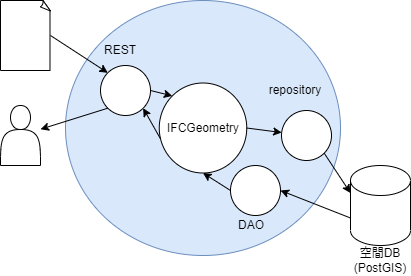
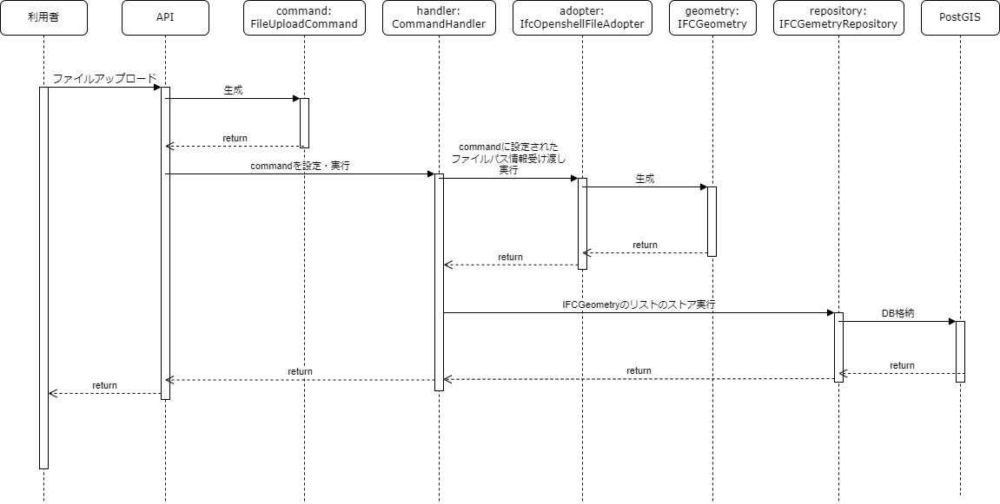
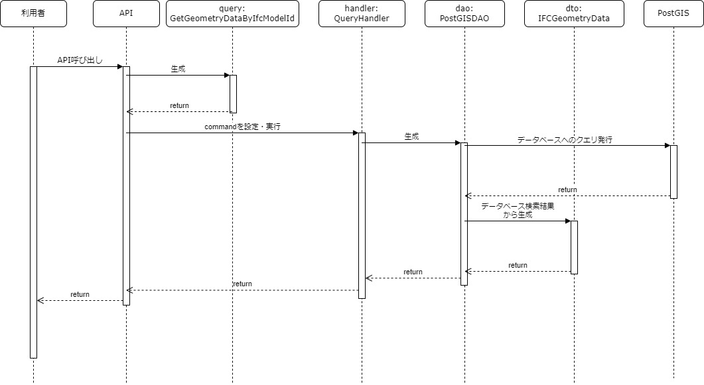

# IFCジオメトリサーバー

**システム概要**
IFCジオメトリサーバーとは、IFC(Industry Foundation Classes)に準拠したBIMデータから抽出した幾何形状データを空間データベースにストアし、提供するサーバサイドアプリケーションです。

**ファイル構成**

root/
├ initdb.d/
├ static/
├ tests/
├ __init__.py
├ command.py
├ converter.py
├ domain.py
├ dto.py
├ infrastructure.py
├ main.py
├ model.py
├ query.py
├ setup.py
└ config.ini

initdb.dにはDBセットアップ用のsqlファイルが入っています。
※docker-compose.yml, Dockerfileは実行環境構築用

- command.py
データのアップロードや作成等のためのビジネスロジックを記述したファイル。

- dto.py
データの検索結果等を表現するクラスと、それのデータ変換機能等を記述したファイル。

- domain.py
幾何形状などを表現するためのドメインモデルを記述したファイル。
ドメインモデルを蓄積・検索するためのrepositoryクラスやDAOクラスのインターフェースがの定義も記述されている。

- infrastructure.py
データの読み出しや書き込みを行うためののrepositoryクラスやDAOクラスの実装クラスが記述されたファイル。

- main.py
サーバーの設置・起動等を行うロジックが記述されたファイル。

- query.py
データ検索のためのビジネスロジックを記述したクラス。

**システム構成**

- システム全体の構成イメージ

- ファイルアップロード時の動作

- データ検索時の動作

