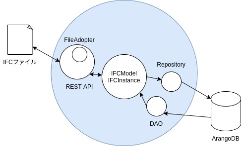
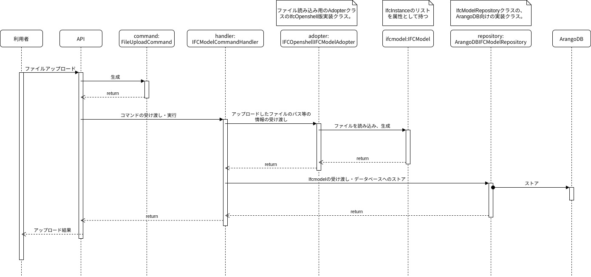
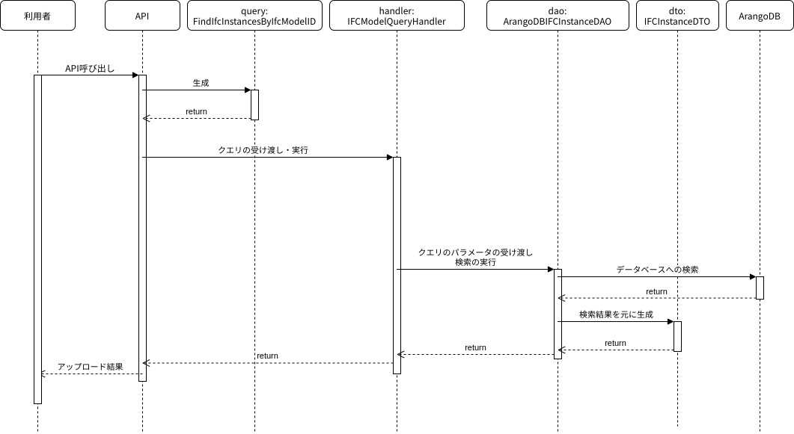

# IFCモデルサーバ

**システム概要**
IFCモデルサーバとは、IFC(Industry Foundation Classes)に準拠したBIMデータをストアし、提供するサーバサイドアプリケーションである。

**ファイル構成**

root/
　├ static/
　├ tests/
　├ uploads/
　├ __init__.py
　├ adopter.py
　├ command.py
　├ dto.py
　├ infrastructure.py
　├ main.py
　├ model.py
　├ query.py
　├ setup.py
　└ config.ini

※docker-compose.yml, Dockerfileは実行環境構築用

- adopter.py
IFCファイル読み込みを行うadopterクラスの実装が記述されたファイル。IfcOpenshell版で実装されている。

- command.py
データのアップロードや作成等のためのビジネスロジックを記述したファイル。

- dto.py
データの検索結果等を表現するクラスと、それのデータ変換機能等を記述したファイル。

- infrastructure.py
データの読み出しや書き込みを行うためののrepositoryクラスやDAOクラスの実装クラスが記述されたファイル。

- main.py
サーバーの設置・起動等を行うロジックが記述されたファイル。

- model.py
IFCのモデルと、IFCモデルを構成するインスタンス群などのモデルの定義、モデルをアップロードや検索するためのインターフェース(repository, adopter, DAO)の定義等を記述する。

- query.py…データ検索のためのビジネスロジックを記述したクラス。

**システム構成**

- システム全体の構成イメージ

- ファイルアップロード時の動作

- データ検索時の動作

